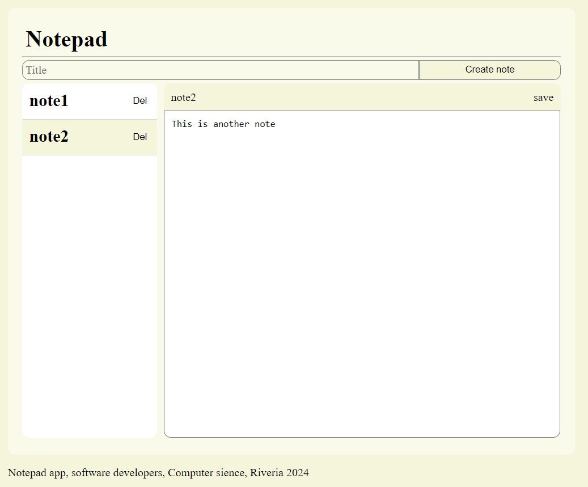
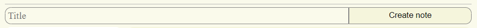
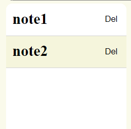
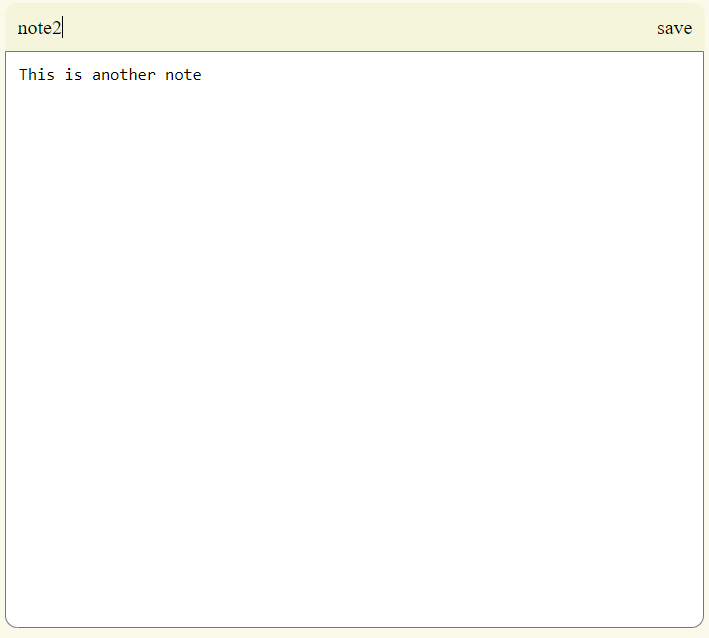
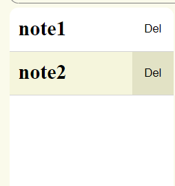

# muistio_24
React muistio sovellus

Sovellus yhdistää MongoDB tietokantaan muistioiden tallentamiseksi, ja siinä on käyttöliittymä muistioiden hallitsemiseksi. Käyttöliittymä on luotu toimimaan vain tietokoneella.

Käyttöliittymässä voi luoda, muokata ja poistaa muistioita.



## 1 käyttö

Voit luoda muitioita kirjoittamalla muistion nimen kohtaan `title`, ja painamalla `Create note` kohtaa. Luodut muistiot ovat tyhjiä.



------

Valitse haluamasi muistio painamalla sen nimeä vasemmassa palkissa



------

Voit muokata muistiota oikealle avatuvassa näkymässä. Voit muokata sekä otsikkoa, että muistion tekstiä. **Muista painaa kohtaa `save`, kun haluat siirtää muutetun tiedon tietokantaan. Sivun uudelleenlataaminen poistaa tiedot joita ei ole tallennettu!**



------

Poista muistio painamalla kohtaa `Del` muistion nimen vieressä vasemmassa palkissa



------

Muistion koko on myöskin rajoitettu, ja muistioiden listasta tulee vieritettävä. Myös muistion sisältöä voi vierittää.

# 2 paikallinen asennus

Sovelluksen asennus tapahtuu kahdessa vaiheessa. Voit joko käynnistää backendin ja frontendin erikseen, tai tehdä buildin frontendistä, ja käynnistää kaiken backendistä.

**Huomaa, että sovelluksen asennusta ei ole testattu eri Noden versioilla. Asennuksen varmistamiseksi käytä Noden versiota `v20.10.0`.**

## 2.1 asetukset

Muutokset ennen käyttöä:

**Backend**

1. Luo tietokanta MongoDB:lla (Käytä MongoDB Atlasta, tai jotain vastaavaa)

Luo myöskin tietokannalle käyttäjä

*Projektissa on käytetty MongoDB Atlasta. Muita vaihtoehtoja ei ole testattu.*

2. MongoDB:n yhdistyslinkin asettaminen

Aseta yhdistyslinkki tietokantaan [.env](backend/.env) -tiedostoon. Muista asettaa käyttäjänimi ja salasana. Aseta myöskin collectionin sijainti.

```conf
# esim
MONGODB_URI = mongodb+srv://<username>:<password>@<cluster>/<collection>[?<options>]
```

*Yhdistyslinkin saa suoraa Atlaksesta, mutta siihen täytyy laittaa käyttäjänimi, salasana ja tarkempi sijainti.*

**Frontend**

1. Aseta backendin sijainti

Aseta linkki, mistä frontend löytää backendin tiedostoon [api/notes.js](frontend\src\api\notes.js)

```JavaScript
// linkki on muotoa http://<sijainti>/api/notes (tai https://...)
// jos käytät sivustoa paikallisesti, linkin muuttaminen ei ole pakollista.
const baseUrl = 'http://localhost:3000/api/notes';
```

**Riippuvuudet**

varmista että kaikki npm riippuvuudet on asennettu suorittamalla komento `npm install` sekä backendissä, että frontendissä.

Komennon tulisi asentaa kaikki riippuvudet automaattisesti

## 2.2 käynnistäminen erikseen

**Jos haluat käyttää sivustoa samassa osoitteessa ja yhdellä terminaalilla, siirry kohtaan [2.3 käynnistäminen samassa osoitteessa](#23-käynnistäminen-samassa-osoitteessa)**

### 2.2.1 backend

Huomaa, että backend tulee käynnistää ennen frontendiä.

1. avaa terminaali backendin kansioon.

2. Käynnistä backend joko nodella, tai nodemonilla

Node:
`node server/app.js`

Nodemon:
`npm run nodemon`

*huomaa, että nodemon scripti on valmiina package.json tiedostossa*

Nodemonin etu noden kanssa on se, että serveriä ei tarvitse käynnistää manuaalisesti kun tehdään muutos lähdekoodiin.

Varmista että backend käynnistyi oikein:
```
-> node server/app.js
Server running on port 3000
MongoDB connected succesfully
```

### 2.2.2 frontend

varmista, että backend on toiminnassa ennen frontendin käynnistämistä

1. avaa toinen terminaali frontendin kansioon, jätä backendin terminaali auki

2. Käynnistä frontend komennolla `npm run start`

Terminaalin pitäisi kysyä portin vaihtoa. Hyväsksy tämä kohta.

varmista että frontend käynnistyi oikein:
```
webpack compiled successfully
```

Sivuston tulisi myöskin avautua verkkosivulle automaattisesti

## 2.3 käynnistäminen samassa osoitteessa

Jos haluat käynnistää sivuston kokonaisuudessaa, tulee sinun luoda build -versio sivustota.

### 2.3.1 Build-version luonti

1. Avaa terminaali frontendin kansioon

2. suorita komento `npm run build`

3. siirrä komennolla luotu `build` kansio sijaintiin [`backend/server`](backend/server/)

### 2.3.2 Käynnistä backend

1. avaa terminaali backendin kansioon.

2. Käynnistä backend joko nodella, tai nodemonilla

Node:
`node server/app.js`

Nodemon:
`npm run nodemon`

*huomaa, että nodemon scripti on valmiina package.json tiedostossa*

Nodemonin etu noden kanssa on se, että serveriä ei tarvitse käynnistää manuaalisesti kun tehdään muutos lähdekoodiin.

Varmista että backend käynnistyi oikein:
```
-> node server/app.js
Server running on port 3000
MongoDB connected succesfully
```

# 3 jatkokehittäminen ja muita asioita

## 3.1 docker/fly.io

Huomaa, että projekti on valmis docker, ja fly.io käyttöön.

Dockerin ja fly.io:n käyttö vaatii käyttöönottoa samaan osoitteeseen. Muista myös asettaa backendin sijaiti tiedostossa [frontend/src/api/notes.js] sen mukaan, missä aiot julkaista sivuston.

Dockerfile on valmiiksi rakennettu, ja sen pitäisi suorittaa sivusto automaattisesti

fly.ion käyttöönotto vaatii myöskin fly.io nimen, ja fly.io projektin. Aseta fly.io projekin nimi tiedostoon [backend/fly.toml](backend/fly.toml)

## 3.2 jatkokehitys

Sivustoa ei tulla jatkokehittämään. 

## 3.3 julkaisu

Sivustosta tulisi poistaa riippuvuus `nodemon` ennen sivuston julkaisua